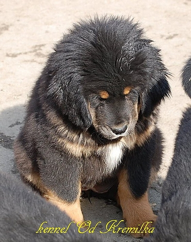

# Implementation of PiT (ICCV2021) Based on PaddlePaddle

This is an unofficial repo based on PaddlePaddle of PiT (ICCV2021): [Rethinking Spatial Dimensions of Vision Transformers](https://openaccess.thecvf.com/content/ICCV2021/papers/Heo_Rethinking_Spatial_Dimensions_of_Vision_Transformers_ICCV_2021_paper.pdf)

English | [简体中文](./README.md)

   * [paddle_pit](#Implementation-of-PiT-(Rethinking-Spatial-Dimensions-of-Vision-Transformers)-Based-on-PaddlePaddle)
      * [1 Introduction](#1-introduction)
      * [2 Accuracy](#2-accuracy)
      * [3 Dataset](#3-dataset)
      * [4 Environment](#4-environment)
      * [5 Quick Start](#5-quick-start)
         * [step1: git and download](#step1-git-and-download)
         * [step2: change arguments](#step2-change-arguments)
         * [step3: eval](#step3-eval)
         * [step4: train](#step4-train)
         * [step5: predict](#step5-predict)
      * [6 Code Structure and Description](#6-code-structure-and-description)
      * [7 Model info](#8-model-info)
      * [8 Citation](#9-citation)

- Paper：[Rethinking Spatial Dimensions of Vision Transformers](https://arxiv.org/pdf/2103.16302v2.pdf).

- Official repo (PyTorch) [PiT](https://github.com/naver-ai/pit).

## 1 Introduction

> From the successful design principles of CNN, we investigate the role of spatial dimension conversion and its effectiveness on transformer-based architecture. We particularly attend to the dimension reduction principle of CNNs; as the depth increases, a conventional CNN increases channel dimension and decreases spatial dimensions. We empirically show that such a spatial dimension reduction is beneficial to a transformer architecture as well, and propose a novel Pooling-based Vision Transformer (PiT) upon the original ViT model.

The algorithm has been summarized in:

<p align="center">

    <h4 align="center"> Algorithm of PiT</h4>
</p>

## 2 Accuracy

|  Model   | Original Acc@1 |  Reproduced Acc@1|Image Size   | batch_size | Crop_pct   | epoch  |
|  ----    |  ----      |  ----     |  ----       | ----       | ----       | ----  |
| pit_ti  |  73.0       |  **72.97**     |224          |256*4GPUs         |0.9         | 300 <br> (+10 COOLDOWN)|

- **NOTE** that the result in the table above is obtained on the validation set of ILSVRC2012. It's worth mentioning that the Acc@1 on the validation set of Light_ILSVRC2012 is **73.17**.

- The model parameters and training logs have been placed in the [output](output) folder.

## 3 Dataset

ImageNet-1k 2012, i.e. [ILSVRC2012](https://image-net.org/challenges/LSVRC/2012/).

- ILSVRC2012 is a large classification dataset, the size of which is 144GB. It contains 1,281,167 training images and 50,000 test images (1000 object categories).

- To save time, this repo uses a lightweight version of ILSVRC2012, named Light_ILSVRC2012, whose size is 65GB. And the links are as follows: [Light_ILSVRC2012_part_0.tar](https://aistudio.baidu.com/aistudio/datasetdetail/114241) and [Light_ILSVRC2012_part_1.tar](https://aistudio.baidu.com/aistudio/datasetdetail/114746).

- You should arrange the dataset following this structure:

    ```
    │imagenet/
    ├──train/
    │  ├── n01440764
    │  │   ├── n01440764_10026.JPEG
    │  │   ├── n01440764_10027.JPEG
    │  │   ├── ......
    │  ├── ......
    ├──val/
    │  ├── n01440764
    │  │   ├── ILSVRC2012_val_00000293.JPEG
    │  │   ├── ILSVRC2012_val_00002138.JPEG
    │  │   ├── ......
    │  ├── ......
    ```

    You may also find [this](https://gist.github.com/BIGBALLON/8a71d225eff18d88e469e6ea9b39cef4) helpful.


## 4 Environment

My Environment：

- Python: 3.7.11
- [PaddlePaddle](https://www.paddlepaddle.org.cn/documentation/docs/en/install/index_en.html): 2.2.2
- [yacs](https://github.com/rbgirshick/yacs)==0.1.8
- scipy
- pyyaml
- Hardware: Tesla V100 * 4, _p.s._, I really appreciate what Baidu PaddlePaddle platform offers me.

## 5 Quick start

### step1: git and download

```
git clone https://github.com/hatimwen/paddle_pit.git
cd paddle_pit
```

### step2: change arguments

Please change the scripts you want to run in [scripts](./scripts/) according to the practical needs.

### step3: eval

- For multi-GPUs pc:

    ```shell
    sh scripts/run_eval_multi.sh
    ```

- For single-GPU pc:

    ```shell
    sh scripts/run_eval.sh
    ```

### step4: train

- For multi-GPUs pc:

    ```
    sh scripts/run_train_multi.sh
    ```

- For single-GPU pc:

    ```
    sh scripts/run_train.sh
    ```

### step5: predict

```
python predict.py \
-pretrained='output/Best_PiT' \
-img_path='images/ILSVRC2012_val_00004506.JPEG'
```

<p align="center">

    <h4 align="center">Picture (id: 244)</h4>
</p>

Output Results:

```
class_id: 244, prob: 0.8468140959739685
```

Clearly, the output is is in line with expectations.

## 6 Code Structure and Description

```
|-- paddle_pit
    |-- output
    |-- configs
        |-- pit_ti.yaml
    |-- datasets
        |-- ImageNet1K
    |-- scripts
        |-- run_train.sh
        |-- run_train_multi.sh
        |-- run_eval.sh
        |-- run_eval_multi.sh
    |-- augment.py
    |-- config.py
    |-- datasets.py
    |-- droppath.py
    |-- losses.py
    |-- main_multi_gpu.py
    |-- main_single_gpu.py
    |-- mixup.py
    |-- model_ema.py
    |-- pit.py
    |-- random_erasing.py
    |-- regnet.py
    |-- transforms.py
    |-- utils.py
    |-- README.md
    |-- requirements.txt
```

## 8 Model info

| Info | Description |
| --- | --- |
| Author | Hatimwen |
| Email | hatimwen@163.com |
| Date | 2022.01 |
| Version | PaddlePaddle 2.2.2 |
| Field | Classification |
| Supported Devices | GPU |
| AI Studio | [AI Studio](https://aistudio.baidu.com/aistudio/clusterprojectdetail/3397849)|

## 9 Citation

```BibTeX
@inproceedings{heo2021pit,
    title={Rethinking Spatial Dimensions of Vision Transformers},
    author={Byeongho Heo and Sangdoo Yun and Dongyoon Han and Sanghyuk Chun and Junsuk Choe and Seong Joon Oh},
    booktitle = {International Conference on Computer Vision (ICCV)},
    year={2021},
}
```

- [pit](https://github.com/naver-ai/pit)

- [PaddlePaddle](https://github.com/paddlepaddle/paddle)

- [PaddleViT](https://github.com/BR-IDL/PaddleViT.git)

Last but not least, thank PaddlePaddle very much for its holding [飞桨论文复现挑战赛（第五期）](https://aistudio.baidu.com/aistudio/competition/detail/126/0/introduction), which helps me learn a lot. Meanwhile, I also thank [Dr. Zhu](https://github.com/xperzy)'s team very much for their [PaddleViT](https://github.com/BR-IDL/PaddleViT) since most of my codes are copied from it except for the whole alignment for the training process. :hearts:
